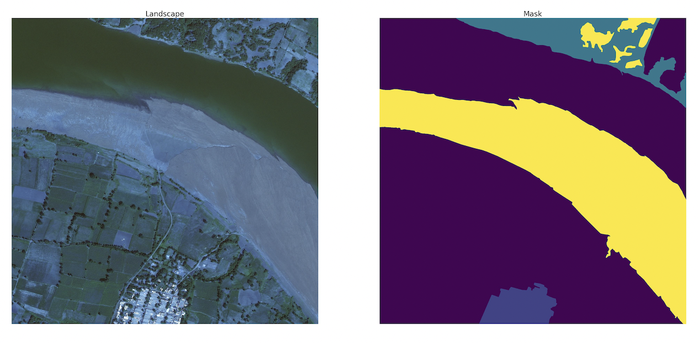
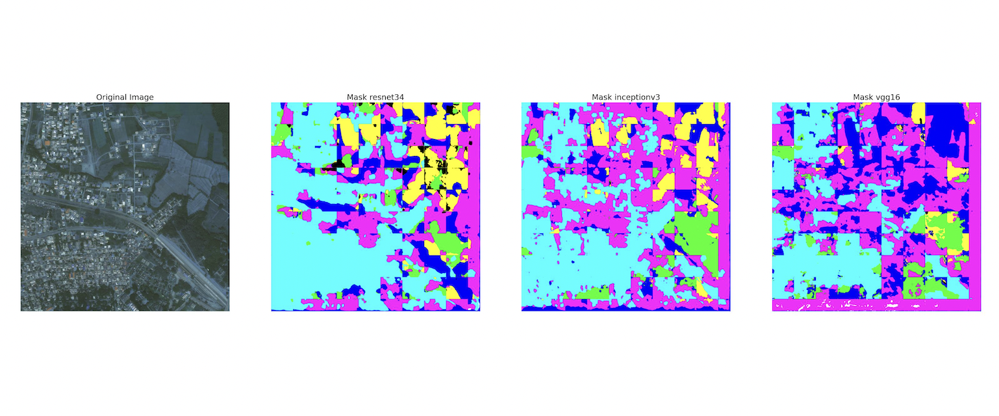
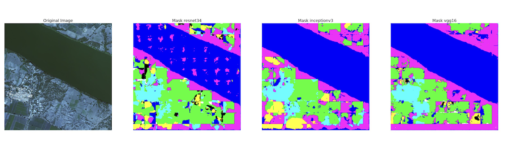

# DeepGlobe-landcover-Classification
Landcover Classification and Segmetation. The number of categories is 7.

Notebook can be also found on [kaggle](https://www.kaggle.com/code/rostekus/deepglobe-land-cover-classification).
Dataset on kaggle: [Deepglobe land cover classification](https://www.kaggle.com/datasets/balraj98/deepglobe-land-cover-classification-dataset)

Images were patchified into 256x256 images.
The models from [segmentation models](https://github.com/qubvel/segmentation_models) was used. SG is the API for keras which
makes much easier usage of U-net or Linknet and also provides pretrained backbones such as VGG or ResNet.

### Dataset
Dataset contains landcovers imagaes and corresponding masks.

   
 

 
### Models
U-net model was used with Resnet, Vgg16, Inceptionv3 backbones.
The reason of stripes on the predicted images is that model was trained on 256x256 patches of images that's why we can only use images of that size.
So if we want to predict mask for image, it is divided into 256x256 images and then fetched into the model after that masks are combined together

   

 

   
 

 
